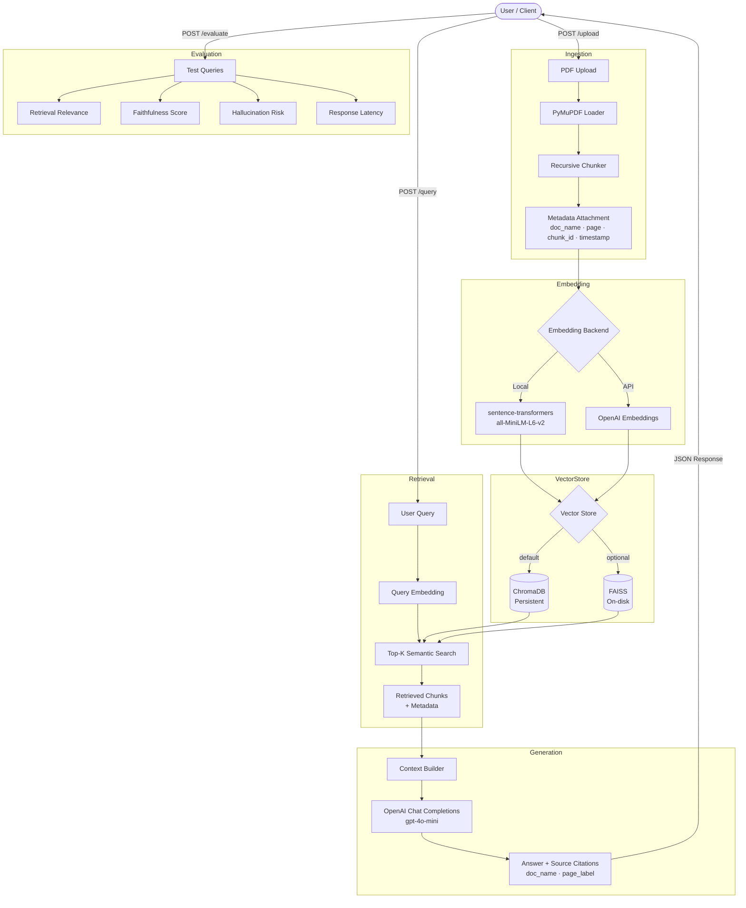

# DocuRAG — Intelligent PDF Question Answering System

> **Production-style Retrieval-Augmented Generation (RAG) platform for intelligent PDF question answering using FastAPI, vector search, source citations, evaluation workflows, and modern AI engineering practices.**

DocuRAG is an independent RAG project demonstrating modern AI engineering practices. The architectural principles explored in this project are representative of techniques commonly used in document intelligence, knowledge retrieval, and AI-assisted information access systems.

> **Disclaimer:** All sample documents used in this project are publicly available academic papers. No confidential, proprietary, or client data is included in this repository.

---

## Project Overview

### Business Problem

Large collections of technical documentation create bottlenecks in information retrieval, evaluation workflows, and knowledge access. Manually searching through hundreds of PDF pages to find specific information is slow, error-prone, and does not scale.

### Solution

DocuRAG uses Retrieval-Augmented Generation (RAG) to provide intelligent semantic search and contextual question answering over PDF document collections. Users upload documents once and can then ask natural-language questions — receiving precise, cited answers that reference the exact document and page number supporting each claim.

---

## Evolution of the Project

### Phase 1 — Notebook Prototype

The project began as an exploratory Jupyter notebook (`notebooks/phase1_pdf_loader.ipynb`) implementing a proof-of-concept RAG pipeline:

- PDF loading with PyMuPDF
- Recursive text chunking
- Sentence-Transformers embeddings
- ChromaDB vector storage
- OpenAI-powered answer generation

This prototype validated the core RAG approach and informed the production architecture.

### Phase 2 — Production-Style Modular Application

The notebook was refactored into a clean, modular Python package with:

- Separated concerns across `ingestion`, `retrieval`, `generation`, and `evaluation` modules
- A FastAPI backend with typed request/response schemas
- A Streamlit frontend for interactive use
- A pluggable vector store supporting ChromaDB and FAISS
- A configurable embedding layer supporting local (sentence-transformers) and OpenAI embeddings
- An evaluation framework with retrieval relevance, faithfulness, and hallucination risk metrics
- Docker support for reproducible deployment
- A full pytest test suite

---

## Key Features

| Feature | Detail |
|---|---|
| **PDF Ingestion** | PyMuPDF page-by-page extraction with metadata |
| **Intelligent Chunking** | Configurable recursive character splitting with overlap |
| **Semantic Embeddings** | `sentence-transformers` (local) or OpenAI Embeddings API |
| **Vector Search** | ChromaDB (default, persistent) or FAISS (optional) |
| **Metadata-Aware Retrieval** | Filter by document name, page number, chunk ID, timestamp |
| **Context Construction** | Ranked context assembly with character-limit guard |
| **LLM Question Answering** | OpenAI Chat Completions with context-grounded prompting |
| **Source Citations** | Every answer includes document name and page number |
| **Batch Upload** | Ingest multiple PDFs in a single API call |
| **FastAPI Backend** | Async API with OpenAPI/Swagger docs |
| **Streamlit Frontend** | Interactive upload, query, and evaluation UI |
| **Evaluation Framework** | Retrieval relevance, faithfulness, hallucination risk, latency |
| **Docker Support** | Multi-service compose for API + frontend |
| **Automated Testing** | Pytest suite covering ingestion, retrieval, and generation |

---

## Architecture



---

## Project Structure

```
DocuRAG/
│
├── app/                          # Core application package
│   ├── config/
│   │   └── settings.py           # Pydantic-Settings — all config via .env
│   ├── ingestion/
│   │   ├── loader.py             # PyMuPDF PDF loader → DocumentPage
│   │   └── chunker.py            # Recursive text splitter → DocumentChunk
│   ├── retrieval/
│   │   ├── embeddings.py         # EmbeddingManager (sentence-transformers / OpenAI)
│   │   ├── vector_store.py       # VectorStoreManager (ChromaDB + FAISS backends)
│   │   └── retriever.py          # Top-k semantic retriever with optional filtering
│   ├── generation/
│   │   └── pipeline.py           # RAGPipeline — retrieves, builds context, cites
│   ├── evaluation/
│   │   └── evaluator.py          # Batch evaluation with 4 metrics
│   └── api/
│       ├── main.py               # FastAPI app factory + lifespan
│       ├── routes.py             # API route handlers
│       ├── schemas.py            # Pydantic request/response models
│       └── dependencies.py       # Singleton DI for embedder / store / pipeline
│
├── frontend/
│   └── app.py                    # Streamlit UI (upload · query · evaluate tabs)
│
├── notebooks/
│   └── phase1_pdf_loader.ipynb   # Phase 1 prototype notebook (preserved)
│
├── tests/
│   ├── test_ingestion.py         # PDFLoader + Chunker tests
│   ├── test_retrieval.py         # EmbeddingManager + VectorStore tests
│   └── test_generation.py        # RAGPipeline + Evaluator tests
│
├── sample_data/
│   └── README.md                 # Instructions for sourcing public test PDFs
│
├── data/
│   └── pdf/                      # Sample public academic PDFs for testing
│
├── Dockerfile
├── docker-compose.yml
├── pyproject.toml
├── requirements.txt
├── .env.example
└── README.md
```

---

## Tech Stack

| Layer | Technology |
|---|---|
| Language | Python 3.10+ |
| PDF Parsing | PyMuPDF (`fitz`) |
| Text Splitting | LangChain `RecursiveCharacterTextSplitter` |
| Embeddings | `sentence-transformers` · OpenAI Embeddings API |
| Vector Store | ChromaDB · FAISS |
| LLM | OpenAI Chat Completions (gpt-4o-mini default) |
| API Framework | FastAPI + Uvicorn |
| Frontend | Streamlit |
| Configuration | Pydantic-Settings |
| Testing | Pytest |
| Containerisation | Docker + Docker Compose |

---

## Setup

### 1 — Clone and create environment

```bash
git clone https://github.com/Nishantsgithub/DocuRAG-Intelligent-PDF-Question-Answering-System.git
cd DocuRAG-Intelligent-PDF-Question-Answering-System

python -m venv .venv
# Windows
.venv\Scripts\activate
# macOS / Linux
source .venv/bin/activate

pip install -r requirements.txt
```

### 2 — Configure environment variables

```bash
cp .env.example .env
# Open .env and set OPENAI_API_KEY=sk-...
```

Key settings (all have sensible defaults):

| Variable | Default | Description |
|---|---|---|
| `OPENAI_API_KEY` | — | Required for generation |
| `EMBEDDING_BACKEND` | `sentence_transformers` | `sentence_transformers` or `openai` |
| `VECTOR_STORE_BACKEND` | `chroma` | `chroma` or `faiss` |
| `CHUNK_SIZE` | `1000` | Characters per chunk |
| `CHUNK_OVERLAP` | `200` | Overlap between chunks |
| `RETRIEVAL_TOP_K` | `5` | Chunks retrieved per query |
| `OPENAI_MODEL` | `gpt-4o-mini` | OpenAI model for generation |

### 3 — Start the API server

```bash
python -m uvicorn app.api.main:app --host 0.0.0.0 --port 8000
# Interactive docs: http://localhost:8000/docs
```

### 4 — Start the Streamlit frontend

```bash
streamlit run frontend/app.py
# UI: http://localhost:8501
```

### 5 — Run with Docker

```bash
cp .env.example .env   # set OPENAI_API_KEY
docker compose up --build
# API:      http://localhost:8000
# Frontend: http://localhost:8501
```

---

## API Endpoints

| Method | Endpoint | Description |
|---|---|---|
| `GET` | `/api/v1/health` | Liveness probe |
| `POST` | `/api/v1/upload` | Upload and ingest a single PDF |
| `POST` | `/api/v1/upload/batch` | Upload and ingest multiple PDFs in one request |
| `POST` | `/api/v1/query` | Ask a question, receive a cited answer |
| `POST` | `/api/v1/evaluate` | Batch evaluation with pipeline metrics |

### Example — single upload

```bash
curl -X POST http://localhost:8000/api/v1/upload \
  -F "file=@sample.pdf"
```

```json
{
  "message": "Document ingested successfully.",
  "doc_name": "sample",
  "pages_loaded": 15,
  "chunks_created": 87
}
```

### Example — batch upload

```bash
curl -X POST http://localhost:8000/api/v1/upload/batch \
  -F "files=@doc1.pdf" \
  -F "files=@doc2.pdf" \
  -F "files=@doc3.pdf"
```

### Example — query

```bash
curl -X POST http://localhost:8000/api/v1/query \
  -H "Content-Type: application/json" \
  -d '{"query": "What is the attention mechanism?", "k": 5}'
```

```json
{
  "query": "What is the attention mechanism?",
  "answer": "The attention mechanism maps a query and a set of key-value pairs to an output...\n\nSources:\n- [Attention, page 3]",
  "citations": [
    {"doc_name": "Attention", "page_label": 3, "chunk_id": "..."},
    {"doc_name": "Attention", "page_label": 5, "chunk_id": "..."}
  ],
  "latency_seconds": 1.87,
  "retrieved_chunk_count": 5
}
```

### Example — evaluate

```bash
curl -X POST http://localhost:8000/api/v1/evaluate \
  -H "Content-Type: application/json" \
  -d '{
    "queries": [
      "What is self-attention?",
      "What are word embeddings?",
      "What is precision in information retrieval?"
    ]
  }'
```

---

## Example Queries

These queries work well with publicly available NLP papers:

- *"What problem does the Transformer architecture solve compared to RNNs?"*
- *"How is multi-head attention computed?"*
- *"What are precision and recall in information retrieval?"*
- *"Explain the difference between encoder and decoder self-attention."*
- *"How do dense embeddings capture semantic similarity?"*

---

## Evaluation Framework

DocuRAG includes a built-in evaluation module with four metrics — no additional LLM calls required:

| Metric | Method | Description |
|---|---|---|
| **Retrieval Relevance** | Lexical overlap | Fraction of retrieved chunks overlapping with a reference answer |
| **Faithfulness** | Lexical overlap | Fraction of answer sentences grounded in the retrieved context |
| **Hallucination Risk** | `1 - faithfulness` | Higher score = more content not traceable to retrieved chunks |
| **Response Latency** | Wall-clock time | End-to-end time from query to generated answer |

Metrics use token-level overlap as a fast, deterministic proxy. For more rigorous evaluation, these can be replaced with embedding-based similarity or an LLM-judge approach.

---

## Testing

```bash
pytest tests/ -v
```

Test results (run against the installed environment):

```
tests/test_generation.py::TestRAGPipeline::test_run_returns_rag_response PASSED
tests/test_generation.py::TestRAGPipeline::test_run_includes_citations PASSED
tests/test_generation.py::TestRAGPipeline::test_run_measures_latency PASSED
tests/test_generation.py::TestRAGPipeline::test_build_context_truncates_at_max_chars PASSED
tests/test_generation.py::TestEvaluationHelpers::test_tokenize_basic PASSED
tests/test_generation.py::TestEvaluationHelpers::test_tokenize_case_insensitive PASSED
tests/test_generation.py::TestEvaluationHelpers::test_retrieval_relevance_full_overlap PASSED
tests/test_generation.py::TestEvaluationHelpers::test_retrieval_relevance_no_overlap PASSED
tests/test_generation.py::TestEvaluationHelpers::test_retrieval_relevance_empty_inputs PASSED
tests/test_generation.py::TestEvaluationHelpers::test_faithfulness_full_grounding PASSED
tests/test_generation.py::TestEvaluationHelpers::test_faithfulness_no_grounding PASSED
tests/test_generation.py::TestEvaluationHelpers::test_faithfulness_not_found_response PASSED
tests/test_generation.py::TestEvaluator::test_evaluate_single_returns_result PASSED
tests/test_generation.py::TestEvaluator::test_evaluate_single_scores_sum_to_one PASSED
tests/test_generation.py::TestEvaluator::test_evaluate_batch_report PASSED
tests/test_generation.py::TestEvaluator::test_evaluate_batch_mismatched_refs_raises PASSED
tests/test_ingestion.py::TestPDFLoader::test_raises_for_missing_file PASSED
tests/test_ingestion.py::TestPDFLoader::test_raises_for_non_pdf PASSED
tests/test_ingestion.py::TestPDFLoader::test_raises_for_empty_directory PASSED
tests/test_ingestion.py::TestPDFLoader::test_load_file_returns_document_pages PASSED
tests/test_ingestion.py::TestChunker::test_chunk_produces_document_chunks PASSED
tests/test_ingestion.py::TestChunker::test_chunk_metadata_propagation PASSED
tests/test_ingestion.py::TestChunker::test_chunk_ids_are_unique PASSED
tests/test_ingestion.py::TestChunker::test_chunk_text_coverage PASSED
tests/test_ingestion.py::TestChunker::test_to_metadata_keys PASSED
tests/test_retrieval.py::TestEmbeddingManager::test_encode_returns_correct_shape PASSED
tests/test_retrieval.py::TestEmbeddingManager::test_encode_raises_on_empty_input PASSED
tests/test_retrieval.py::TestVectorStoreChroma::test_empty_store_count PASSED
tests/test_retrieval.py::TestVectorStoreChroma::test_add_and_count PASSED
tests/test_retrieval.py::TestVectorStoreChroma::test_search_returns_results PASSED
tests/test_retrieval.py::TestVectorStoreChroma::test_filter_by_doc_name PASSED
tests/test_retrieval.py::TestVectorStoreChroma::test_reset_collection PASSED
tests/test_retrieval.py::TestVectorStoreChroma::test_add_chunks_raises_on_mismatch PASSED
tests/test_retrieval.py::TestVectorStoreFAISS::test_add_and_search PASSED

34 passed
```

---

## Screenshots

> Screenshots will be added after UI walkthrough. Sections reserved for:

| Section | Description |
|---|---|
| Swagger API Docs | Interactive API documentation at `/docs` |
| PDF Upload | Single and batch PDF ingestion via Streamlit |
| Query Workflow | Natural-language question with retrieved context |
| Source Citations | Answer with document name and page number |
| Evaluation Dashboard | Batch metrics: relevance, faithfulness, latency |

---

## Future Improvements

| Area | Improvement |
|---|---|
| **Retrieval** | Hybrid BM25 + dense retrieval |
| **Retrieval** | Cross-encoder reranking |
| **Retrieval** | Multi-vector / late interaction models (ColBERT) |
| **Generation** | Streaming responses |
| **Evaluation** | LLM-judge and embedding-based metrics |
| **API** | Authentication and rate limiting |
| **Observability** | Request tracing, latency dashboards |
| **Scalability** | Async ingestion queue for large document batches |
| **UI** | Document management (list / delete ingested docs) |

---

## Repository Description

> Production-style Retrieval-Augmented Generation (RAG) platform for intelligent PDF question answering using FastAPI, vector search, source citations, evaluation workflows, and modern AI engineering practices.

## Topics

`rag` `retrieval-augmented-generation` `langchain` `llm` `openai` `chromadb` `faiss` `fastapi` `streamlit` `artificial-intelligence` `machine-learning` `semantic-search` `document-intelligence` `python`
