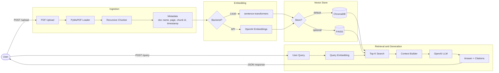

<h1 align="center">DocuRAG — Intelligent PDF Question Answering</h1>

<p align="center">
  
  
  
  
  
  
  
</p>

<p align="center">
  <strong>Production-style Retrieval-Augmented Generation (RAG) platform for intelligent PDF question answering.</strong><br/>
  Upload documents. Ask questions. Get cited answers — with the exact document and page every claim comes from.
</p>

---

> DocuRAG is an independent RAG project demonstrating modern AI engineering practices. The architectural principles explored here are representative of techniques commonly used in document intelligence, knowledge retrieval, and AI-assisted information access systems.

> **Data disclaimer:** All sample documents in this repository are publicly available academic papers. No confidential, proprietary, or client data is included.

---

## Table of Contents

- [Project Overview](#project-overview)
- [Project Evolution](#project-evolution)
- [Key Features](#key-features)
- [Architecture](#architecture)
- [Project Structure](#project-structure)
- [Tech Stack](#tech-stack)
- [Setup](#setup)
- [API Reference](#api-reference)
- [Example Queries](#example-queries)
- [Evaluation Framework](#evaluation-framework)
- [Testing](#testing)
- [Screenshots](#screenshots)
- [Future Improvements](#future-improvements)

---

## Project Overview

### Business Problem

Large collections of technical documentation create bottlenecks in information retrieval and knowledge access. Manually searching through hundreds of PDF pages is slow, error-prone, and does not scale.

### Solution

DocuRAG uses Retrieval-Augmented Generation (RAG) to provide intelligent semantic search and contextual question answering over PDF document collections. Users upload documents once and ask natural-language questions — receiving precise, cited answers that reference the exact document and page number supporting each claim.

---

## Project Evolution

### Phase 1 — Notebook Prototype

The project began as an exploratory Jupyter notebook (`notebooks/phase1_pdf_loader.ipynb`) validating the core RAG approach:

- PDF loading with PyMuPDF
- Recursive text chunking with configurable overlap
- Sentence-Transformers dense embeddings
- ChromaDB vector storage and retrieval
- OpenAI-powered answer generation with context grounding

### Phase 2 — Production-Style Modular Application

The prototype was refactored into a clean, modular Python package:

- **Separated concerns** across `ingestion`, `retrieval`, `generation`, and `evaluation` modules
- **FastAPI backend** with full OpenAPI documentation and typed schemas
- **Streamlit frontend** for interactive upload, query, and evaluation
- **Pluggable vector store** — ChromaDB (default) or FAISS
- **Pluggable embedding layer** — local `sentence-transformers` or OpenAI Embeddings API
- **Evaluation framework** measuring retrieval relevance, faithfulness, and hallucination risk
- **Docker support** for reproducible, containerised deployment
- **34-test pytest suite** covering all pipeline stages

---

## Key Features

| Feature | Detail |
|---|---|
| **PDF Ingestion** | PyMuPDF page-by-page extraction with full provenance metadata |
| **Intelligent Chunking** | Configurable recursive character splitting with configurable overlap |
| **Semantic Embeddings** | `sentence-transformers` (local, no API cost) or OpenAI Embeddings API |
| **Vector Search** | ChromaDB (default, persistent) or FAISS (optional, on-disk) |
| **Metadata-Aware Retrieval** | Filter by document name; results include page, chunk ID, timestamp |
| **Context Construction** | Ranked context assembly with character-budget guard |
| **LLM Question Answering** | OpenAI Chat Completions — context-grounded, hallucination-resistant prompting |
| **Source Citations** | Every answer includes document name and page number |
| **Single & Batch Upload** | Ingest one PDF or many in a single API call |
| **FastAPI Backend** | Async REST API with interactive Swagger docs at `/docs` |
| **Streamlit Frontend** | Upload, query, and evaluate via browser UI |
| **Evaluation Framework** | Retrieval relevance, faithfulness, hallucination risk, latency |
| **Docker Support** | `docker compose up` runs API + frontend together |
| **Automated Testing** | 34 pytest tests across ingestion, retrieval, generation, and evaluation |

---

## Architecture



---

## Project Structure

```
DocuRAG-Intelligent-PDF-Question-Answering-System/
│
├── app/                          # Core production package
│   ├── config/
│   │   └── settings.py           # All config via pydantic-settings + .env
│   ├── ingestion/
│   │   ├── loader.py             # PyMuPDF loader  →  DocumentPage objects
│   │   └── chunker.py            # Recursive text splitter  →  DocumentChunk objects
│   ├── retrieval/
│   │   ├── embeddings.py         # EmbeddingManager (sentence-transformers or OpenAI)
│   │   ├── vector_store.py       # VectorStoreManager (ChromaDB + FAISS backends)
│   │   └── retriever.py          # Top-k semantic retriever with optional filtering
│   ├── generation/
│   │   └── pipeline.py           # RAGPipeline — retrieve, build context, generate, cite
│   ├── evaluation/
│   │   └── evaluator.py          # Batch evaluation: 4 metrics, no LLM calls required
│   └── api/
│       ├── main.py               # FastAPI app factory with lifespan hooks
│       ├── routes.py             # Route handlers for all endpoints
│       ├── schemas.py            # Pydantic request / response models
│       └── dependencies.py       # Singleton dependency injection
│
├── frontend/
│   └── app.py                    # Streamlit UI (upload, query, evaluate tabs)
│
├── notebooks/
│   └── phase1_pdf_loader.ipynb   # Phase 1 prototype — preserved as historical reference
│
├── tests/
│   ├── test_ingestion.py         # PDFLoader + Chunker unit tests
│   ├── test_retrieval.py         # EmbeddingManager + VectorStore unit tests
│   └── test_generation.py        # RAGPipeline + Evaluator unit tests
│
├── data/
│   ├── pdf/                      # Sample public academic PDFs (see below)
│   └── text_files/               # Supplementary sample text for testing
│
├── sample_data/
│   └── README.md                 # Guide to sourcing additional public test PDFs
│
├── Dockerfile
├── docker-compose.yml
├── pyproject.toml
├── requirements.txt
├── .env.example                  # All environment variables documented
└── README.md
```

**Sample PDFs included** (`data/pdf/`):

| File | Source |
|---|---|
| `Attention.pdf` | "Attention Is All You Need" — Vaswani et al., 2017 (public) |
| `Embeddings.pdf` | Public NLP embeddings reference paper |
| `Retrieval.pdf` | Public information retrieval textbook chapter |

---

## Tech Stack

| Layer | Technology |
|---|---|
| Language | Python 3.10+ |
| PDF Parsing | PyMuPDF (`fitz`) |
| Text Splitting | LangChain `RecursiveCharacterTextSplitter` |
| Embeddings | `sentence-transformers` · OpenAI Embeddings API |
| Vector Store | ChromaDB · FAISS |
| LLM | OpenAI Chat Completions (`gpt-4o-mini` default) |
| API | FastAPI + Uvicorn |
| Frontend | Streamlit |
| Configuration | Pydantic-Settings |
| Testing | Pytest |
| Containers | Docker + Docker Compose |

---

## Setup

### Prerequisites

- Python 3.10 or higher
- An [OpenAI API key](https://platform.openai.com/api-keys) (required for answer generation)

### 1 — Clone the repository

```bash
git clone https://github.com/Nishantsgithub/DocuRAG-Intelligent-PDF-Question-Answering-System.git
cd DocuRAG-Intelligent-PDF-Question-Answering-System
```

### 2 — Create a virtual environment and install dependencies

```bash
python -m venv .venv
```

```bash
# Windows
.venv\Scripts\activate

# macOS / Linux
source .venv/bin/activate
```

```bash
pip install -r requirements.txt
```

### 3 — Configure environment variables

```bash
# Windows
copy .env.example .env

# macOS / Linux
cp .env.example .env
```

Open `.env` and set at minimum:

```env
OPENAI_API_KEY=sk-...
```

All other settings have sensible defaults:

| Variable | Default | Description |
|---|---|---|
| `OPENAI_API_KEY` | — | **Required** for answer generation |
| `OPENAI_MODEL` | `gpt-4o-mini` | OpenAI model used for generation |
| `EMBEDDING_BACKEND` | `sentence_transformers` | `sentence_transformers` (free, local) or `openai` |
| `VECTOR_STORE_BACKEND` | `chroma` | `chroma` (persistent) or `faiss` (on-disk index) |
| `CHUNK_SIZE` | `1000` | Characters per text chunk |
| `CHUNK_OVERLAP` | `200` | Overlap characters between consecutive chunks |
| `RETRIEVAL_TOP_K` | `5` | Number of chunks retrieved per query |

### 4 — Start the API server

```bash
python -m uvicorn app.api.main:app --host 0.0.0.0 --port 8000
```

Interactive API docs available at **http://localhost:8000/docs**

### 5 — Start the Streamlit frontend

In a second terminal (with the venv activated):

```bash
streamlit run frontend/app.py
```

UI available at **http://localhost:8501**

### 6 — Run with Docker (optional)

```bash
# Windows
copy .env.example .env

# macOS / Linux
cp .env.example .env
```

```bash
docker compose up --build
```

- API: **http://localhost:8000**
- Frontend: **http://localhost:8501**

---

## API Reference

| Method | Endpoint | Description |
|---|---|---|
| `GET` | `/api/v1/health` | Liveness probe |
| `POST` | `/api/v1/upload` | Upload and ingest a single PDF |
| `POST` | `/api/v1/upload/batch` | Upload and ingest multiple PDFs in one request |
| `POST` | `/api/v1/query` | Ask a question, receive a cited answer |
| `POST` | `/api/v1/evaluate` | Batch evaluation with pipeline metrics |

Full interactive documentation available at **http://localhost:8000/docs** when the server is running.

### Upload a document

```bash
curl -X POST http://localhost:8000/api/v1/upload \
  -F "file=@attention.pdf"
```

```json
{
  "message": "Document ingested successfully.",
  "doc_name": "attention",
  "pages_loaded": 15,
  "chunks_created": 87
}
```

### Batch upload

```bash
curl -X POST http://localhost:8000/api/v1/upload/batch \
  -F "files=@attention.pdf" \
  -F "files=@embeddings.pdf" \
  -F "files=@retrieval.pdf"
```

### Query the corpus

```bash
curl -X POST http://localhost:8000/api/v1/query \
  -H "Content-Type: application/json" \
  -d '{"query": "What is the attention mechanism?", "k": 5}'
```

```json
{
  "query": "What is the attention mechanism?",
  "answer": "The attention mechanism maps a query and a set of key-value pairs to an output...\n\nSources:\n- [attention, page 3]",
  "citations": [
    {"doc_name": "attention", "page_label": 3, "chunk_id": "21ab0f0d-..."},
    {"doc_name": "attention", "page_label": 5, "chunk_id": "3356e535-..."}
  ],
  "latency_seconds": 1.87,
  "retrieved_chunk_count": 5
}
```

### Query with document filter

```bash
curl -X POST http://localhost:8000/api/v1/query \
  -H "Content-Type: application/json" \
  -d '{"query": "What is precision and recall?", "k": 5, "filter_doc_name": "retrieval"}'
```

### Run evaluation

```bash
curl -X POST http://localhost:8000/api/v1/evaluate \
  -H "Content-Type: application/json" \
  -d '{
    "queries": [
      "What is self-attention?",
      "What are word embeddings?",
      "What is recall in information retrieval?"
    ]
  }'
```

```json
{
  "num_queries": 3,
  "avg_latency_seconds": 2.14,
  "avg_retrieval_relevance": 0.857,
  "avg_faithfulness": 0.912,
  "avg_hallucination_risk": 0.088,
  "answer_rate": 1.0
}
```

---

## Example Queries

These queries work well with the included sample papers:

| Query | Expected source |
|---|---|
| *"What problem does the Transformer solve compared to RNNs?"* | Attention.pdf |
| *"How is multi-head attention computed?"* | Attention.pdf |
| *"What are precision and recall in information retrieval?"* | Retrieval.pdf |
| *"Explain the difference between encoder and decoder self-attention."* | Attention.pdf |
| *"How do dense embeddings capture semantic similarity?"* | Embeddings.pdf |

---

## Evaluation Framework

DocuRAG includes a built-in evaluation module — no additional LLM calls required:

| Metric | Method | Description |
|---|---|---|
| **Retrieval Relevance** | Lexical token overlap | Fraction of retrieved chunks overlapping with a reference answer |
| **Faithfulness** | Lexical token overlap | Fraction of answer sentences grounded in the retrieved context |
| **Hallucination Risk** | `1 - faithfulness` | Higher = more content not traceable to retrieved chunks |
| **Response Latency** | Wall-clock time | End-to-end time from query submission to final answer |

Lexical overlap is used as a fast, deterministic, zero-cost proxy. For production use, replace with embedding-based similarity or an LLM-judge approach.

---

## Testing

```bash
pytest tests/ -v
```

All 34 tests pass against the current codebase:

```
tests/test_generation.py::TestRAGPipeline::test_run_returns_rag_response PASSED
tests/test_generation.py::TestRAGPipeline::test_run_includes_citations PASSED
tests/test_generation.py::TestRAGPipeline::test_run_measures_latency PASSED
tests/test_generation.py::TestRAGPipeline::test_build_context_truncates_at_max_chars PASSED
tests/test_generation.py::TestEvaluationHelpers::test_tokenize_basic PASSED
tests/test_generation.py::TestEvaluationHelpers::test_tokenize_case_insensitive PASSED
tests/test_generation.py::TestEvaluationHelpers::test_retrieval_relevance_full_overlap PASSED
tests/test_generation.py::TestEvaluationHelpers::test_retrieval_relevance_no_overlap PASSED
tests/test_generation.py::TestEvaluationHelpers::test_retrieval_relevance_empty_inputs PASSED
tests/test_generation.py::TestEvaluationHelpers::test_faithfulness_full_grounding PASSED
tests/test_generation.py::TestEvaluationHelpers::test_faithfulness_no_grounding PASSED
tests/test_generation.py::TestEvaluationHelpers::test_faithfulness_not_found_response PASSED
tests/test_generation.py::TestEvaluator::test_evaluate_single_returns_result PASSED
tests/test_generation.py::TestEvaluator::test_evaluate_single_scores_sum_to_one PASSED
tests/test_generation.py::TestEvaluator::test_evaluate_batch_report PASSED
tests/test_generation.py::TestEvaluator::test_evaluate_batch_mismatched_refs_raises PASSED
tests/test_ingestion.py::TestPDFLoader::test_raises_for_missing_file PASSED
tests/test_ingestion.py::TestPDFLoader::test_raises_for_non_pdf PASSED
tests/test_ingestion.py::TestPDFLoader::test_raises_for_empty_directory PASSED
tests/test_ingestion.py::TestPDFLoader::test_load_file_returns_document_pages PASSED
tests/test_ingestion.py::TestChunker::test_chunk_produces_document_chunks PASSED
tests/test_ingestion.py::TestChunker::test_chunk_metadata_propagation PASSED
tests/test_ingestion.py::TestChunker::test_chunk_ids_are_unique PASSED
tests/test_ingestion.py::TestChunker::test_chunk_text_coverage PASSED
tests/test_ingestion.py::TestChunker::test_to_metadata_keys PASSED
tests/test_retrieval.py::TestEmbeddingManager::test_encode_returns_correct_shape PASSED
tests/test_retrieval.py::TestEmbeddingManager::test_encode_raises_on_empty_input PASSED
tests/test_retrieval.py::TestVectorStoreChroma::test_empty_store_count PASSED
tests/test_retrieval.py::TestVectorStoreChroma::test_add_and_count PASSED
tests/test_retrieval.py::TestVectorStoreChroma::test_search_returns_results PASSED
tests/test_retrieval.py::TestVectorStoreChroma::test_filter_by_doc_name PASSED
tests/test_retrieval.py::TestVectorStoreChroma::test_reset_collection PASSED
tests/test_retrieval.py::TestVectorStoreChroma::test_add_chunks_raises_on_mismatch PASSED
tests/test_retrieval.py::TestVectorStoreFAISS::test_add_and_search PASSED

34 passed in ~30s
```

---

## Screenshots

> Screenshots to be added after UI walkthrough. The Streamlit interface includes:
>
> - **Upload tab** — drag-and-drop single or multi-file PDF ingestion with live progress
> - **Query tab** — natural-language question input with answer, citations, and latency metrics
> - **Evaluate tab** — batch query evaluation with relevance, faithfulness, and hallucination risk scores

To explore interactively now, start the server and open **http://localhost:8000/docs** for the Swagger UI.

---

## Future Improvements

| Area | Improvement |
|---|---|
| **Retrieval** | Hybrid BM25 + dense retrieval (sparse + dense fusion) |
| **Retrieval** | Cross-encoder reranking for improved precision |
| **Retrieval** | Multi-vector / late interaction models (ColBERT) |
| **Generation** | Streaming responses for lower perceived latency |
| **Evaluation** | LLM-judge and embedding-based evaluation metrics |
| **API** | JWT authentication and per-user rate limiting |
| **Observability** | Request tracing, latency dashboards, error alerting |
| **Scalability** | Async ingestion queue for large document batches |
| **UI** | Document management — list, delete, and re-ingest documents |

---

## License

This project is licensed under the MIT License — see [LICENSE](LICENSE) for details.
